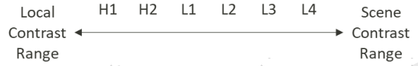

# AI Contrast

## Introduction

AI Contrast is MediaTek's cutting-edge technology designed to enhance the contrast performance of both HDR(High Dynamic Range) and SDR(Standard Dynamic Range) content.
This sophisticated AI system intelligently analyzes and processes image data, categorizing it into various contrast levels and integrating then into two distinct maps:

- The Scene Contrast Map, which augments the contrast in larger areas
- The Local Contrast Map, which boosts the contrast in more localized regions

By leveraging AI to precisely fine-tune the contrast within these specific areas, the technology ensures the screen displays the most dynamic and vivid contrast possible, resulting int a strikingly pronounced and extreme contrast effect.

## Abbreviations

| Abbreviation | Description               |
|--------------|---------------------------|
| APN          | Application Note          |
| HDR          | High Dynamic Range        |
| SDR          | Standard Dynamic Range    |

## Contrast Strength Control

MTK leverages advanced AI technology to provide precise control over contrast strength at each level.
The AI Contrast System intelligently categorizes HDR information into four distinct ranges: L1, L2, L3, and L4, each equipped with corresponding adjustment options.
For SDR content, the AI refines this approach by dividing it into six contrast ranges: H1, H2, L1, L2, L3, and L4. You can independently adjust the contrast intensity for both brighter and darker areas at each specified level to achieve optimal visual effects.
The contrast range for each level is illustrated in the following figure. It's important to note that the levels H1 and H2 are exclusively supported by SDR content.

Contrast strength control registers

| Register | Sub-IP | Bit | Default | Note |
|----------|--------|-----|---------|------|
| Itmo_contrast_gain_bright_H1 | Itmo | 10 | 0x10 | Contrast strength of level H1 brighter part. Only supports SDR content. |
| Itmo_contrast_gain_dark_H1   | Itmo | 10 | 0x10 | Contrast strength of level H1 darker part. Only supports SDR content. |
| Itmo_contrast_gain_bright_H2 | Itmo | 10 | 0x10 | Contrast strength of level H2 brighter part. Only supports SDR content. |
| Itmo_contrast_gain_dark_H2   | Itmo | 10 | 0x10 | Contrast strength of level H2 darker part. Only supports SDR content. |
| Itmo_contrast_gain_bright_L1 | Itmo | 10 | 0x10 | Contrast strength of level L1 brighter part. |
| Itmo_contrast_gain_dark_L1   | Itmo | 10 | 0x10 | Contrast strength of level L1 darker part. |
| Itmo_contrast_gain_bright_L2 | Itmo | 10 | 0x10 | Contrast strength of level L2 brighter part. |
| Itmo_contrast_gain_dark_L2   | Itmo | 10 | 0x10 | Contrast strength of level L2 darker part. |
| Itmo_contrast_gain_bright_L3 | Itmo | 10 | 0x10 | Contrast strength of level L3 brighter part. |
| Itmo_contrast_gain_dark_L3   | Itmo | 10 | 0x10 | Contrast strength of level L3 darker part. |
| Itmo_contrast_gain_bright_L4 | Itmo | 10 | 0x10 | Contrast strength of level L4 brighter part. |
| Itmo_contrast_gain_dark_L4   | Itmo | 10 | 0x10 | Contrast strength of level L4 darker part. |

AI Contrast excels at improving the contrast in local areas, which includes enhancing both details and potential noise.
Distinguishing between these two can be challenging. To prevent boosting noise or creating banding effects, MTK has developed additional tuning options that lower the contrast in less detailed, flat areas.
You can adjust the degree of contrast reduction at each level, ensuring that the image remains clear and detailed without amplifying unwanted noise.
This approach allows for precise control, maintaining a professional quality while enhancing the viewing experience.

Contrast strength ratio control registers in flat area

| Register                     | Sub-IP | Bit | Default | Note                                           |
|------------------------------|--------|-----|---------|------------------------------------------------|
| Itmo_contrast_gain_bright_flat_H1 | Itmo   | 10  | 0x40    | Contrast strength ratio of level H1 brighter part at flat area. Only supports SDR content. 0x40=1x |
| Itmo_contrast_gain_dark_flat_H1   | Itmo   | 10  | 0x40    | Contrast strength ratio of level H1 darker part at flat area. Only supports SDR content. 0x40=1x |
| Itmo_contrast_gain_bright_flat_H2 | Itmo   | 10  | 0x40    | Contrast strength ratio of level H2 brighter part at flat area. Only supports SDR content. 0x40=1x |
| Itmo_contrast_gain_dark_flat_H2   | Itmo   | 10  | 0x40    | Contrast strength ratio of level H2 darker part at flat area. Only supports SDR content. 0x40=1x |
| Itmo_contrast_gain_bright_flat_L1 | Itmo   | 10  | 0x40    | Contrast strength ratio of level L1 brighter part at flat area. 0x40=1x |
| Itmo_contrast_gain_dark_flat_L1   | Itmo   | 10  | 0x40    | Contrast strength ratio of level L1 darker part at flat area. 0x40=1x |
| Itmo_contrast_gain_bright_flat_L2 | Itmo   | 10  | 0x40    | Contrast strength ratio of level L2 brighter part at flat area. 0x40=1x |
| Itmo_contrast_gain_dark_flat_L2   | Itmo   | 10  | 0x40    | Contrast strength ratio of level L2 darker part at flat area. 0x40=1x |
| Itmo_contrast_gain_bright_flat_L3 | Itmo   | 10  | 0x40    | Contrast strength ratio of level L3 brighter part at flat area. 0x40=1x |
| Itmo_contrast_gain_dark_flat_L3   | Itmo   | 10  | 0x40    | Contrast strength ratio of level L3 darker part at flat area. 0x40=1x |
| Itmo_contrast_gain_bright_flat_L4 | Itmo   | 10  | 0x40    | Contrast strength ratio of level L4 brighter part at flat area. 0x40=1x |
| Itmo_contrast_gain_dark_flat_L4   | Itmo   | 10  | 0x40    | Contrast strength ratio of level L4 darker part at flat area. 0x40=1x |

## Luma Adaptive Control

The contrast strength can also be adjusted based on the luminance of each pixel.
Specifically, dark regions and bright regions within the same image can receive different contrast strengths through the Luma daptive LUT, which contains 17 entries.

The Luma Adaptive LUT is designed to reduce contrast in either dark ro bright areas.
To achieve this, it's recommended to apply lower bright contrast values to regions with high luminance values and lower dark contrast values to regions with low luminance.
It's crucial to ensure that the LUT values are kept smooth to prevent any undesirable side effects.

The Local Contrast Luma Adaptive LUT manages the contrast strength of more localized areas, enhancing details and clarity where it matters most.
Conversely, the Scene Contrast Luma Adaptive LUT oversees the contrast strength across broader areas, ensuring a balanced and impactful visual experience.
Additionally, the Local Contrast Luma Adaptive LUT is further divided into two specialized LUTs: the Local Contrast Highlight Luma Adaptive LUT, designed to adjust the local contrast in brighter surroundings, and the Local Contrast Shadow Luma Adaptive LUT, which focuses on the local contrast in darker surroundings.

Scene contrast bright luma adaptive control registers

| Register                     | Sub-IP | Bit | Default | Note                      |
|------------------------------|--------|-----|---------|---------------------------|
| scene_contrast_bright_luma_lut_0  | Itmo   | 8   | 0x40    | 0x40=1x |
| scene_contrast_bright_luma_lut_1  | Itmo   | 8   | 0x40    | 0x40=1x |
| scene_contrast_bright_luma_lut_2  | Itmo   | 8   | 0x40    | 0x40=1x |
| scene_contrast_bright_luma_lut_3  | Itmo   | 8   | 0x40    | 0x40=1x |
| scene_contrast_bright_luma_lut_4  | Itmo   | 8   | 0x40    | 0x40=1x |
| scene_contrast_bright_luma_lut_5  | Itmo   | 8   | 0x40    | 0x40=1x |
| scene_contrast_bright_luma_lut_6  | Itmo   | 8   | 0x40    | 0x40=1x |
| scene_contrast_bright_luma_lut_7  | Itmo   | 8   | 0x40    | 0x40=1x |
| scene_contrast_bright_luma_lut_8  | Itmo   | 8   | 0x40    | 0x40=1x |
| scene_contrast_bright_luma_lut_9  | Itmo   | 8   | 0x40    | 0x40=1x |
| scene_contrast_bright_luma_lut_10 | Itmo   | 8   | 0x40    | 0x40=1x |
| scene_contrast_bright_luma_lut_11 | Itmo   | 8   | 0x40    | 0x40=1x |
| scene_contrast_bright_luma_lut_12 | Itmo   | 8   | 0x40    | 0x40=1x |
| scene_contrast_bright_luma_lut_13 | Itmo   | 8   | 0x40    | 0x40=1x |
| scene_contrast_bright_luma_lut_14 | Itmo   | 8   | 0x40    | 0x40=1x |
| scene_contrast_bright_luma_lut_15 | Itmo   | 8   | 0x40    | 0x40=1x |
| scene_contrast_bright_luma_lut_16 | Itmo   | 8   | 0x40    | 0x40=1x |

Scene contrast dark luma adaptive control registers

| Register                   | Sub-IP | Bit | Default | Note                      |
|----------------------------|--------|-----|---------|---------------------------|
| scene_contrast_dark_luma_lut_0  | Itmo   | 8   | 0x40    | 0x40=1x |
| scene_contrast_dark_luma_lut_1  | Itmo   | 8   | 0x40    | 0x40=1x |
| scene_contrast_dark_luma_lut_2  | Itmo   | 8   | 0x40    | 0x40=1x |
| scene_contrast_dark_luma_lut_3  | Itmo   | 8   | 0x40    | 0x40=1x |
| scene_contrast_dark_luma_lut_4  | Itmo   | 8   | 0x40    | 0x40=1x |
| scene_contrast_dark_luma_lut_5  | Itmo   | 8   | 0x40    | 0x40=1x |
| scene_contrast_dark_luma_lut_6  | Itmo   | 8   | 0x40    | 0x40=1x |
| scene_contrast_dark_luma_lut_7  | Itmo   | 8   | 0x40    | 0x40=1x |
| scene_contrast_dark_luma_lut_8  | Itmo   | 8   | 0x40    | 0x40=1x |
| scene_contrast_dark_luma_lut_9  | Itmo   | 8   | 0x40    | 0x40=1x |
| scene_contrast_dark_luma_lut_10 | Itmo   | 8   | 0x40    | 0x40=1x |
| scene_contrast_dark_luma_lut_11 | Itmo   | 8   | 0x40    | 0x40=1x |
| scene_contrast_dark_luma_lut_12 | Itmo   | 8   | 0x40    | 0x40=1x |
| scene_contrast_dark_luma_lut_13 | Itmo   | 8   | 0x40    | 0x40=1x |
| scene_contrast_dark_luma_lut_14 | Itmo   | 8   | 0x40    | 0x40=1x |
| scene_contrast_dark_luma_lut_15 | Itmo   | 8   | 0x40    | 0x40=1x |
| scene_contrast_dark_luma_lut_16 | Itmo   | 8   | 0x40    | 0x40=1x |

Local contrast highlight bright luma adaptive control registers

| Register                   | Sub-IP | Bit | Default | Note                      |
|----------------------------|--------|-----|---------|---------------------------|
| scene_contrast_highlight_bright_luma_lut_0  | Itmo   | 8   | 0x40    | 0x40=1x |
| scene_contrast_highlight_bright_luma_lut_1  | Itmo   | 8   | 0x40    | 0x40=1x |
| scene_contrast_highlight_bright_luma_lut_2  | Itmo   | 8   | 0x40    | 0x40=1x |
| scene_contrast_highlight_bright_luma_lut_3  | Itmo   | 8   | 0x40    | 0x40=1x |
| scene_contrast_highlight_bright_luma_lut_4  | Itmo   | 8   | 0x40    | 0x40=1x |
| scene_contrast_highlight_bright_luma_lut_5  | Itmo   | 8   | 0x40    | 0x40=1x |
| scene_contrast_highlight_bright_luma_lut_6  | Itmo   | 8   | 0x40    | 0x40=1x |
| scene_contrast_highlight_bright_luma_lut_7  | Itmo   | 8   | 0x40    | 0x40=1x |
| scene_contrast_highlight_bright_luma_lut_8  | Itmo   | 8   | 0x40    | 0x40=1x |
| scene_contrast_highlight_bright_luma_lut_9  | Itmo   | 8   | 0x40    | 0x40=1x |
| scene_contrast_highlight_bright_luma_lut_10 | Itmo   | 8   | 0x40    | 0x40=1x |
| scene_contrast_highlight_bright_luma_lut_11 | Itmo   | 8   | 0x40    | 0x40=1x |
| scene_contrast_highlight_bright_luma_lut_12 | Itmo   | 8   | 0x40    | 0x40=1x |
| scene_contrast_highlight_bright_luma_lut_13 | Itmo   | 8   | 0x40    | 0x40=1x |
| scene_contrast_highlight_bright_luma_lut_14 | Itmo   | 8   | 0x40    | 0x40=1x |
| scene_contrast_highlight_bright_luma_lut_15 | Itmo   | 8   | 0x40    | 0x40=1x |
| scene_contrast_highlight_bright_luma_lut_16 | Itmo   | 8   | 0x40    | 0x40=1x |

Local contrast highlight dark luma adaptive control registers

| Register                   | Sub-IP | Bit | Default | Note                      |
|----------------------------|--------|-----|---------|---------------------------|
| scene_contrast_highlight_dark_luma_lut_0  | Itmo   | 8   | 0x40    | 0x40=1x |
| scene_contrast_highlight_dark_luma_lut_1  | Itmo   | 8   | 0x40    | 0x40=1x |
| scene_contrast_highlight_dark_luma_lut_2  | Itmo   | 8   | 0x40    | 0x40=1x |
| scene_contrast_highlight_dark_luma_lut_3  | Itmo   | 8   | 0x40    | 0x40=1x |
| scene_contrast_highlight_dark_luma_lut_4  | Itmo   | 8   | 0x40    | 0x40=1x |
| scene_contrast_highlight_dark_luma_lut_5  | Itmo   | 8   | 0x40    | 0x40=1x |
| scene_contrast_highlight_dark_luma_lut_6  | Itmo   | 8   | 0x40    | 0x40=1x |
| scene_contrast_highlight_dark_luma_lut_7  | Itmo   | 8   | 0x40    | 0x40=1x |
| scene_contrast_highlight_dark_luma_lut_8  | Itmo   | 8   | 0x40    | 0x40=1x |
| scene_contrast_highlight_dark_luma_lut_9  | Itmo   | 8   | 0x40    | 0x40=1x |
| scene_contrast_highlight_dark_luma_lut_10 | Itmo   | 8   | 0x40    | 0x40=1x |
| scene_contrast_highlight_dark_luma_lut_11 | Itmo   | 8   | 0x40    | 0x40=1x |
| scene_contrast_highlight_dark_luma_lut_12 | Itmo   | 8   | 0x40    | 0x40=1x |
| scene_contrast_highlight_dark_luma_lut_13 | Itmo   | 8   | 0x40    | 0x40=1x |
| scene_contrast_highlight_dark_luma_lut_14 | Itmo   | 8   | 0x40    | 0x40=1x |
| scene_contrast_highlight_dark_luma_lut_15 | Itmo   | 8   | 0x40    | 0x40=1x |
| scene_contrast_highlight_dark_luma_lut_16 | Itmo   | 8   | 0x40    | 0x40=1x |

Local contrast shadow bright luma adaptive control registers

| Register                   | Sub-IP | Bit | Default | Note                      |
|----------------------------|--------|-----|---------|---------------------------|
| scene_contrast_shadow_bright_luma_lut_0  | Itmo   | 8   | 0x40    | 0x40=1x |
| scene_contrast_shadow_bright_luma_lut_1  | Itmo   | 8   | 0x40    | 0x40=1x |
| scene_contrast_shadow_bright_luma_lut_2  | Itmo   | 8   | 0x40    | 0x40=1x |
| scene_contrast_shadow_bright_luma_lut_3  | Itmo   | 8   | 0x40    | 0x40=1x |
| scene_contrast_shadow_bright_luma_lut_4  | Itmo   | 8   | 0x40    | 0x40=1x |
| scene_contrast_shadow_bright_luma_lut_5  | Itmo   | 8   | 0x40    | 0x40=1x |
| scene_contrast_shadow_bright_luma_lut_6  | Itmo   | 8   | 0x40    | 0x40=1x |
| scene_contrast_shadow_bright_luma_lut_7  | Itmo   | 8   | 0x40    | 0x40=1x |
| scene_contrast_shadow_bright_luma_lut_8  | Itmo   | 8   | 0x40    | 0x40=1x |
| scene_contrast_shadow_bright_luma_lut_9  | Itmo   | 8   | 0x40    | 0x40=1x |
| scene_contrast_shadow_bright_luma_lut_10 | Itmo   | 8   | 0x40    | 0x40=1x |
| scene_contrast_shadow_bright_luma_lut_11 | Itmo   | 8   | 0x40    | 0x40=1x |
| scene_contrast_shadow_bright_luma_lut_12 | Itmo   | 8   | 0x40    | 0x40=1x |
| scene_contrast_shadow_bright_luma_lut_13 | Itmo   | 8   | 0x40    | 0x40=1x |
| scene_contrast_shadow_bright_luma_lut_14 | Itmo   | 8   | 0x40    | 0x40=1x |
| scene_contrast_shadow_bright_luma_lut_15 | Itmo   | 8   | 0x40    | 0x40=1x |
| scene_contrast_shadow_bright_luma_lut_16 | Itmo   | 8   | 0x40    | 0x40=1x |

Local contrast shadow dark luma adaptive control registers

| Register                   | Sub-IP | Bit | Default | Note                      |
|----------------------------|--------|-----|---------|---------------------------|
| scene_contrast_shadow_dark_luma_lut_0  | Itmo   | 8   | 0x40    | 0x40=1x |
| scene_contrast_shadow_dark_luma_lut_1  | Itmo   | 8   | 0x40    | 0x40=1x |
| scene_contrast_shadow_dark_luma_lut_2  | Itmo   | 8   | 0x40    | 0x40=1x |
| scene_contrast_shadow_dark_luma_lut_3  | Itmo   | 8   | 0x40    | 0x40=1x |
| scene_contrast_shadow_dark_luma_lut_4  | Itmo   | 8   | 0x40    | 0x40=1x |
| scene_contrast_shadow_dark_luma_lut_5  | Itmo   | 8   | 0x40    | 0x40=1x |
| scene_contrast_shadow_dark_luma_lut_6  | Itmo   | 8   | 0x40    | 0x40=1x |
| scene_contrast_shadow_dark_luma_lut_7  | Itmo   | 8   | 0x40    | 0x40=1x |
| scene_contrast_shadow_dark_luma_lut_8  | Itmo   | 8   | 0x40    | 0x40=1x |
| scene_contrast_shadow_dark_luma_lut_9  | Itmo   | 8   | 0x40    | 0x40=1x |
| scene_contrast_shadow_dark_luma_lut_10 | Itmo   | 8   | 0x40    | 0x40=1x |
| scene_contrast_shadow_dark_luma_lut_11 | Itmo   | 8   | 0x40    | 0x40=1x |
| scene_contrast_shadow_dark_luma_lut_12 | Itmo   | 8   | 0x40    | 0x40=1x |
| scene_contrast_shadow_dark_luma_lut_13 | Itmo   | 8   | 0x40    | 0x40=1x |
| scene_contrast_shadow_dark_luma_lut_14 | Itmo   | 8   | 0x40    | 0x40=1x |
| scene_contrast_shadow_dark_luma_lut_15 | Itmo   | 8   | 0x40    | 0x40=1x |
| scene_contrast_shadow_dark_luma_lut_16 | Itmo   | 8   | 0x40    | 0x40=1x |

## Chroma Adaptive Control

MTK offers three specialized functions for chroma adaptive control: Hue Adaptive, Saturation Adaptive, and Skin Protection.
Each function is designed to safeguard color integrity by adjusting the contrast strength according to the specific characteristics of the content.
This ensures that colors are accurately represented and maintained across various types of media.

For Hue Adaptive function, you can adjust the contrast strength based on the hue of each pixel.
Precisely, regions with different hues within the same image can receive different contrast strengths through the Hue Adaptive LUT, which contains 12 entries.
The color area defined by the Hue value is illustrated in the following figure.
It's crucial to ensure that the LUT values, including the first entry and the last entry, are kept smooth to prevent any undesirable side effects.

