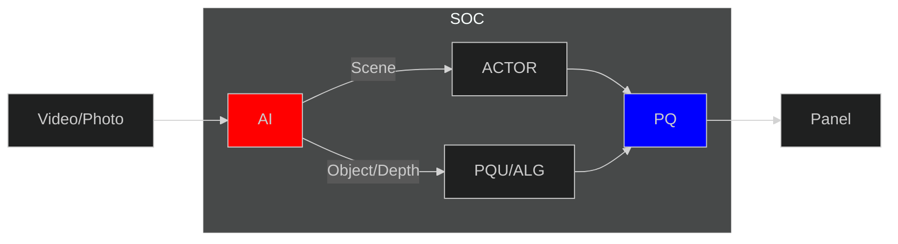

# AIPQ

## 1. Introduction

MTK's AIPQ(Artificial Intelligence Picture Quality) detects the current content
and provides enhanced picture quality to the user based on the AI result.

MTK's AIPQ can be divided into two main components: AI and PQ.

- The AI component analyzes the captured source and generates an AI result
- The AIPQ controller then sends this result to both the ACTOR and PQU components.
- The ACTOR adjusts the scene's PQ settings based on the scene result,
while PQU adjusts the object/depth PQ settings based on the object/depth result



## 2. Definitions and Abbreviations

| Term   | Explanation |
|--------|-------------|
| `AIPQ`  | Artificial Intelligence Picture Quality |
| `ALG`   | Algorithm |
| `API`   | Application Programming Interface |
| `PQU`   | Picture Quality Unit |

## 3. Configuration and Customization Guidelines

The configuration file is a type of ini file.
Path: vendor/mediatek/tv/misdk/preinstall/mtXXXX/linux/config/pq/aipq.ini

| Parameter | Description |
|-----------|-------------|
| `MODLE_BIN_PATH`  | The path of AI.bin |
| `MODLE_FREQUENCY` | [5, 60] fps |

## 4. AI Result

MTK provides APIs for customers to obtain AI results.
Customers can proceed with their own PQ algorithms based on the AI results to realize better PQ.

```c++
Return<void> aipqGetResultData(int32_t s32PqId, qipaGetResultData_cb) override

struct ST_AIPQ_Scene_RESULT_DATA {
    // [0x00, 0xFF] score of Face,Blue,Green,Food,Architecture,Anime,Sport,Movie
    uint8_t vecU8Scene[8];
};

struct ST_AIPQ_OBJ_RESULT_DATA {
    // top,left,width,height [0x0000, 0x8000]
    uint32_t u32X; // x,y center of face/text
    uint32_t u32Y;
    uint32_t u32W;
    uint32_t u32H;
    uint32_t u32ConfidenceObj;   // [0, 100]% face/text
    uint32_t u32ConfidenceFront; // N/A
    uint32_t u32ConfidenceRight; // N/A
    uint32_t u32ConfidenceLeft;  // N/A
};

struct ST_AIPQ_RESULT_DATA {
    vector<uint8_t> vecU8Scene; // [0, 255] * 8
    vector<uint8_t> vecU8Depth; // Depth_map[32][32]
    vector<ST_AIPQ_OBJ_RESULT_DATA> vecStObject; // 32*30
    vector<ST_AIPQ_OBJ_RESULT_DATA> vecStText;   // 32*30
};
```
