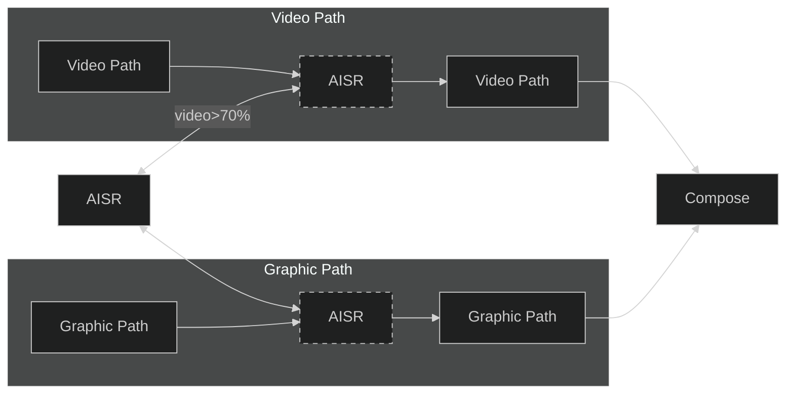

# AISR OSD

## Introduction

The AISR engin can locate at video path or Graphic Path.



AISR OSD & video path switch behavior:

if video display size is larger than a specific size(which by default is 70%), the AISR engine will apply to the video path, otherwise it will apply to the GOP path.

## Definitions and Abbreviations

| Term   | Explanation |
|--------|-------------|
| `AISR` | AI Super Resolution |
| `OSD`  | On-Screen Display |
| `GOP`  | Graphics Output Protocol |
| `AOW`  | Android One World |

## Process Overview

### Main Decision Rules

- The default launcher will stay in GOP AISR when boot up.
- No video and OSD alpha-zero will remain in video AISR after video display.
- Video path of user-scenarios:
    1. Only video signal
        - Whole video size > programing size in config -> Enter video AISR
    2. Video AISR with GOP
        - Display video size > programing size in config -> Enter video AISR
    3. Video switches to no signal
        - OSD alpha count > ROI_threshold -> Back to GOP AISR
        - OSD alpha count <= ROI_threshold -> Stay in video AISR

#### Window Parameters

- Window parameter 1
  - Window size is larger then X% panel display area(%X can be programmed by users)
  - Window H size is lager than Y% total display H size(%Y can be programmed by users)
  - The default X and Y is 70%

- Window parameter 2
  - Window size is larger than W% panel display area(%W can be programmed by users)
  - Window V size is larger than Z% total display V size(%Z can be programmed by users)
  - The default W is 30% and Z is 80%

### Customized API

#### AOW Customized API

```c++
RenderRetVal SetForceGraphicAisrInfo(ST_FORCE_GRAPHIC_AISR_INFO_Parcel stForceGraphicAisrInfo);
```

#### Linux Customized API

```c
enum MI_RESULT {
    E_MI_OK,
    E_MI_ERR_NOT_SUPPORT,
    E_MI_ERR_FAILED,
}

enum MI_OSD_AISR_ForceType_e {
    E_MI_OSD_AISR_FORCE_ENABLE_AUTO,
    E_MI_OSD_AISR_FORCE_GOP,
    E_MI_OSD_AISR_FORCE_XC,
    E_MI_OSD_AISR_MAX,
};

MI_RESULT MI_OSD_Set_AisrForce(MI_OSD_AISR_ForceType_e *eAisrForceType);
```

## AISR Features

### AISR Video Path

- Supports AISR 1X, 2X, 3X, 4X scaling up
- Supports YUV 444/422
- Does not support 3D passive model
- Does not support PC mode

### AISR GOP

- Supports AISR 1X and 2X scaling up
- Supports ARGB8888

## Troubleshooting

Program AISR video path parameters by the following command:

```shell
cat /vendor/tvconfig/bsp/chip/mt9655/pq/presetdb/aisr_win_param.json
```

Monitor the current AISR Video path parameters by the following command:

```shell
dumpsys vendor.mediatek.hardware.pq.IPq/default -enable
dumpsys vendor.mediatek.hardware.pq.IPq/default --dump
```

Program AISR GOP path parameters by the following command:

```shell
cat /vendor/tvconfig/bsp/chip/mt9655/pq/gop_domain/qmap_main/online/cfd/presetDB_cfd.json
```
