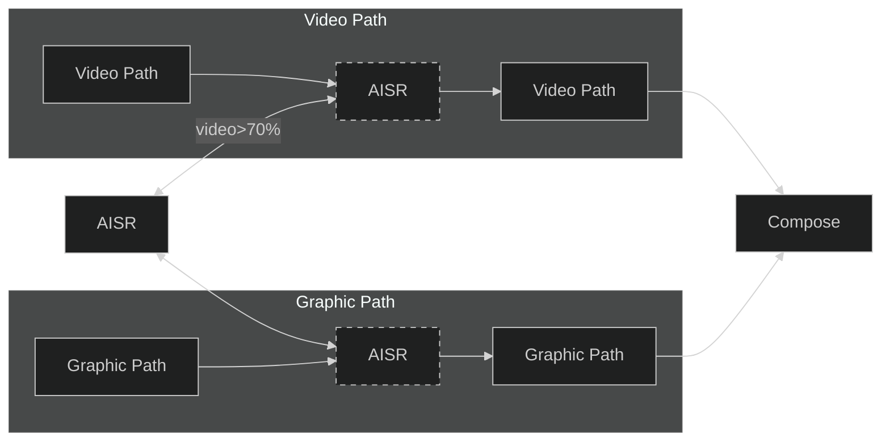

# AISR OSD

## Introduction

The AISR engin can locate at video path or Graphic Path.

AISR OSD & video path switch behavior:

if video display size is larger than a specific size(which by default is 70%), the AISR engine will apply to the video path, otherwise it will apply to the GOP path.

## Definitions and Abbreviations

| Term   | Explanation |
|--------|-------------|
| `AISR` | AI Super Resolution |
| `OSD`  | On-Screen Display |
| `GOP`  | Graphics Output Protocol |
| `AOW`  | Android One World |
