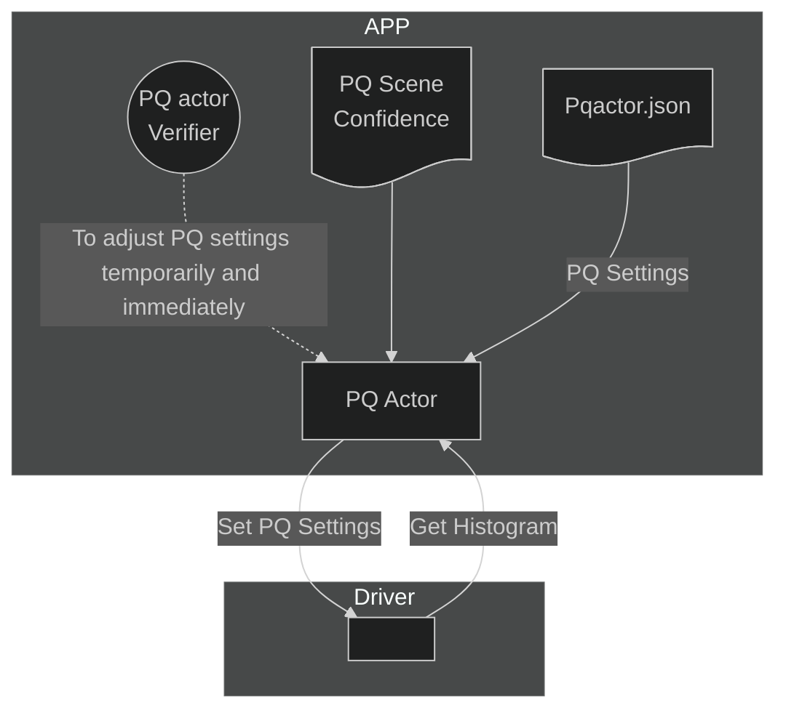

# PQ Actor

## Overview

PQ Actor smoothly applies PQ settings according to AI scene confidence.

## Basic Knowledge

### The way to set PQ

PQ actor parses configuration files to get PQ settings after being enabled.
PQ actor sets up settings gradually for each scene type according to AI scene confidences and color histogram.
Also, PQ actor is set by the unit test called PQ Actor Verifier during run-time.
PQ Actor applies the PQ settings smoothly, called a transition.
Once the PQ actor gets the setting of the scene type, it applies PQ settings step by step.
The step size is adjustable in the configuration file.

### Use Cases of Scene Type in Scene Detection Model

| ID | Scene Type |
|----|------------|
| 0  | Green     |
| 1  | Sky    |
| 2  | Face      |
| 3  | Architecture |
| 4  | Food |
| 5  | Animation |
| 6  | Sport |
| 7  | Movie |

MTK implements PQ flow in PQ Actor for scene types such as green, sky,
face, architecture, and food. However, for scene types like animation, sport, and movie, customers are required to develop and implement their own PQ flow.

### Hue, Saturation, and Luma Settings

The Hue, Saturation, and Luma settings are based on sections of Hue.
There are 14 sections in Hue:

| Index | Name |
|-------|------|
| 0     | Red  |
| 1     | Flesh-Red |
| 2     | Flesh |
| 3     | Flesh-Yellow |
| 4     | Yellow |
| 5     | Yellow-Cyan |
| 6     | Green |
| 7     | Green-Cyan |
| 8     | Cyan |
| 9     | Cyan-Blue |
| 10    | Blue |
| 11    | Blue-Magenta |
| 12    | Magenta |
| 13    | Magenta-Red |

The details of Hue, Saturation, and Luma shown in the following table.
The Format "S.15.16" represents that the parameter is signed, 15 bits of integer, and 16 bits of float

| Value | Desc | Default | Min | Max | Format |
|-------|------|---------|-----|-----|--------|
| Hue   | Rotate Degree | 0x0000 | 0xFFC40000(-60.0) | 0x3C0000(60.0) | S.15.16 |
| Saturation | Gain | 0x010000(1.0) | 0x000000(0.0) | 0x020000(2.0) | S.15.16 |
| Luma  | Gain | 0x010000(1.0) | 0x000000(0.0) | 0x020000(2.0) | S.15.16 |

### Sharpness Strength adn Skin Protection Gain

| Value | Desc | Default | Min | Max |
|-------|------|---------|-----|-----|
| Sharpness | Gain | 26 | 0 | 63 |
| Skin | Gain | 31 | 0 | 255 |
