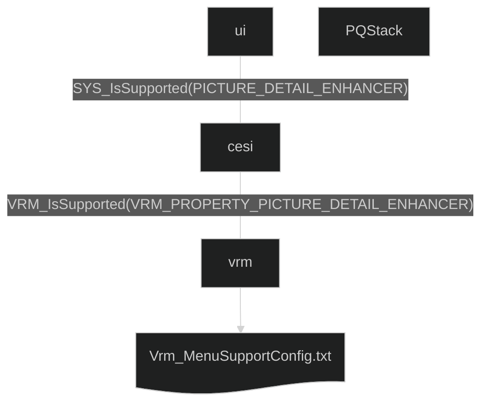
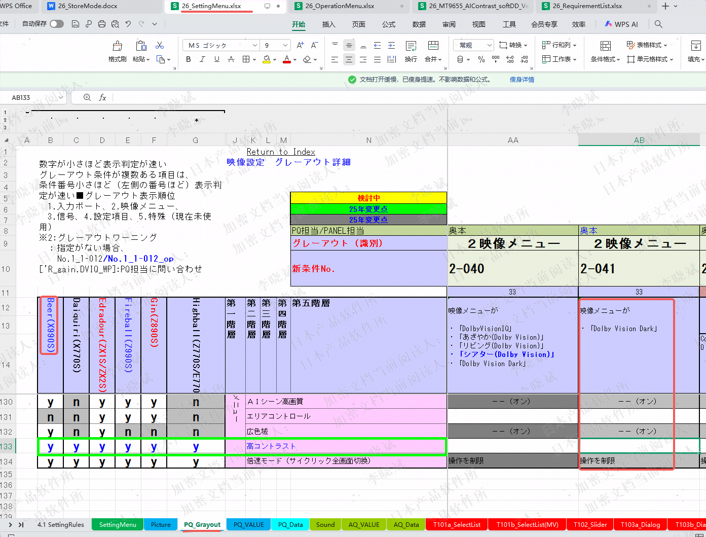
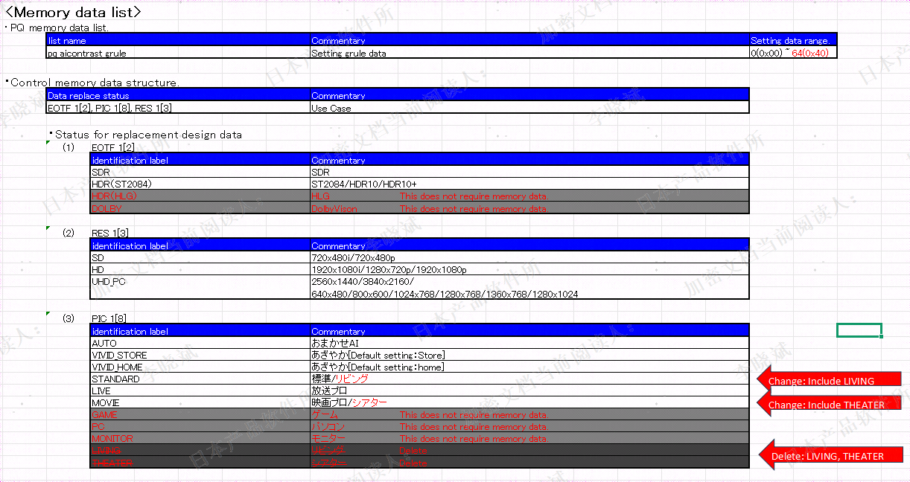
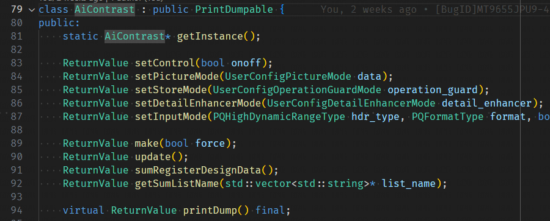

# AI Contrast

## Overview



## Add Menu

### Requirements

1. 增加高对比度Demo菜单
    全机型开；Demo启动条件控制？
    对接CESI

2. Demo操作开关转PQ参数
    Demo高对比度开 -> PQ 细节增强开，质感开
    Demo高对比度关 -> PQ 细节增强关，质感关

3. Demo播放，图像菜单置灰
    细节增，质感置灰

4. 退Demo恢复用户 细节增强，质感设置

### Impl Menu Management

1. Add VRM_PROPERTY_PICTURE_HIGH_CONTRAST

    FunctionManager/include/vrm.h

    ```c
    typedef enum {
        ...
        VRM_PROPERTY_PICTURE_HIGH_CONTRAST,  /* 高コントラスト */
        VRM_PROPERTY_PICTURE_MAX,
    } VrmProperty;
    ```

    26_SettingMenu.xlsx PQ_Grayout
    

    MSConfig/SWConfig/{petname}/vrm/Vrm_MenuSupportConfig.txt

    ```txt
    ...
    121 VRM_PROPERTY_PICTURE_HIGH_CONTRAST    YES
    ```

    vrm_menu_check.c

    ```c
    bool Vrm_canconfig_HighContrast(int idx, VrmMenuGrayOutReason *reason)
    {
        ...
        return true;
    }
    ```

2. vrm get/set to PQ stack

    FunctionManager/include/vrm.h

    ```c
    extern U32 VRM_SetHighContrast(VrmTypeCtrlMode mode);
    extern VrmTypeCtrlMode VRM_GetHighContrast(void);
    ```

    FunctionManager/vrm/prm/vrm_picture.c

    ```c
    U32 VRM_SetHighContrast(VrmTypeCtrlMode mode) {
        ...
        if (!Vrm_canconfig_Operate(VRM_PROPERTY_PICTURE_HIGH_CONTRAST, NULL)) {
            return VRM_STATUS_NG;
        }
        ...
        VrmPicDb.PicVolatileData.HighContrast = mode;
        return vrm_SynchronousSendQue(VRM_FNC_UPDATE_PICTURE_QUALITY, 0, 0, (KC_TICKS2SEC/10)*3);
    }
    VrmTypeCtrlMode VRM_GetHighContrast(void) {
        return (VrmTypeCtrlMode)VrmPicDb.PicVolatileData.HighContrast;
    }
    ```

3. CESI

    FunctionManager/dtvif/dtvif.cpp \
    FunctionManager/dtvif/dtvif_pq.hpp \
    FunctionManager/dtvif/dtvif_pq.cpp

    ```c++
    ReturnCode_e SET_GetPropertyForPictureXXX(PropertyInfo *property_info) {
        ...
        VRM_GetXXX();
        ...
        return ReturnCode_e::NO_ERROR;
    }
    ReturnCode_e SET_SetPropertyForPictureXXX(PropertyInfo *property_info) {
        ...
        VRM_SetXXX();
        ...
        return ReturnCode_e::NO_ERROR;
    }
    ```

## SoftDD SUM file

### SoftDD requirements

### Impl SUM file management

1. 26_MT9655_AIContrast_softDD_Ver1.10_20251106.xlsx SUM_data_structure

    convert
    
    to
    
    implement manager class
    

2. generate SUM file

    Create a `sum_list` directory in the root directory of the USB drive, \
    place a sum_list.txt file in the root directory, with the content as follows(the file name in the content also come from SoftDD):

    ```txt
    pq_aicontrast_grule
    ```

    Compile the upgrade package, upgrade the TV, and execute the following command to generate the configuration file:

    ```shell
    SYS>sum/dtv2usb 0
    [SUM](f:sum/src/sum.c l:1496)(SUM_saveToMediaNoIndex) WRITE (no index)
    [SUM](f:sum/src/sum.c l:1426)(Sum_rwListonMedia   ) START..
    
     [DTV->USB] pq_aicontrast_grule.csv
    [SUM](f:sum/src/sum.c l:1484)(Sum_rwListonMedia   ) FINISH
    ```

3. Config generated SUM file acording to SoftDD

4. Compile and upgrade TV, and verify the SUM file

    ```shell
    sum/c
    Commands:
     command      : shows this message.
     edit         : moves into edit-mode.
     go ID        : moves into edit-mode by ID.
     val VALUE    : moves into edit-mode and set value.
     list         : shows all registered lists.
     list LISTNAME: changes target list to LISTNAME.
     sl STRING    : changes target list by searching STRING.
     refresh      : calls the registered function for refreshing.
     write        : calls the registered function for writing data onto FlashROM.
    previous     : switches to the previous list.
    next         : switches to the next list.
    ```

    use `sum/e` to verify contents of SUM file.
