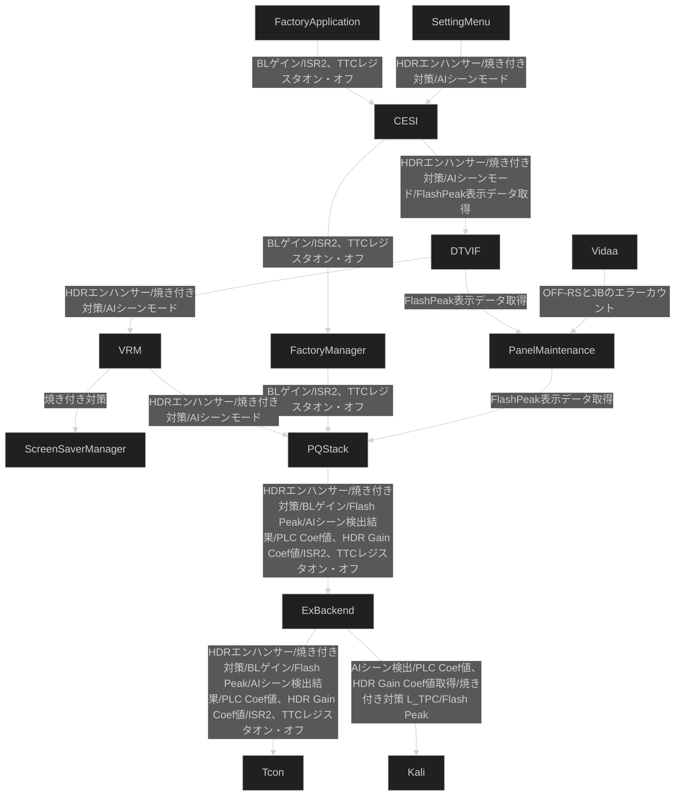

# PQ OLED

## Terms

| Term   | Definition                                   | Note                                                                                                                                        |
| ------ | -------------------------------------------- | ------------------------------------------------------------------------------------------------------------------------------------------- |
| OLED   | Organic Light Emitting Diode(有机发光二极管) | A type of display technology that uses organic compounds to emit light when an electric current is applied.                                 |
| LGD    | LG Display                                   | A South Korean company that manufactures display panels, including OLEDs.                                                                   |
| LCD    | Liquid Crystal Display(液晶)                 | A type of display technology that uses liquid crystals to modulate light, typically requiring a backlight.                                  |
| PWM    | Pulse Width Modulation(脉宽调制)             | 通过快速开关像素（频率可达数百 Hz）控制亮度，占空比（亮/灭时间比例）决定感知亮度                                                            |
| T-CON  | Timing Controller(时序控制器)                | 通过调整像素驱动电流/电压直接控制每个像素的发光强度                                                                                         |
| MAXCLL | Maximum Content Light Level(最大内容光级)    | 指视频内容中最亮的像素的亮度，通常以坎德拉每平方米（cd/m²）为单位表示。                                                                     |
| TPC    | Temporary Power Control                      | 检测出静止画面后画面整体亮度降低的功能                                                                                                      |
| L-TPC  | Local Temporary Power Control                | 屏 TPC 的亮度下调量、亮度下调时间无法任意设定，此功能为 REGZA 的客制功能。基本上与 TPC 相同，但可判断并调整亮度和 timing。※可通过 KALI 控制 |
| LEA3   | Logo Extraction Algorithm                    | 检测 LOGO，并降低该部分的亮度                                                                                                               |
| CPC    | Convex Power Control                         | 降低屏幕周边亮度                                                                                                                            |
| TCC    | Temperature Compensation Concept             | 检测屏幕温度控制亮度                                                                                                                        |
| LBC2   | Local Brightness Control 2                   | 计算画面内 block 单位的累积平均电流，控制亮度                                                                                               |
| LSR2   |                                              | 通过 OLED 的各画素的使用记录推算烧屏位置，控制多个烧屏对策 (LEA, CPC, TCE, ISUR)                                                            |

|
| TTC | | 使用 1 年之后，30 分钟以上电源 On 的情况下，分阶段降低高峰亮度，提高残影、使用寿命的技术（屏幕电源 On/Off 之后，恢复原来亮度） |
| ISUR | Image Sticking Uniformity Recovery | 提高烧屏位置周边的亮度，加速周边的烧屏，降低烧屏位置的亮度，延缓烧屏位置的烧屏效果，使烧屏位置和周边位置的烧屏量更平均、不显眼 |
| TCE | Target current constrained enhancement | 从各帧的图像信息分析 APL 和图像的标准偏差，根据映像补偿 ganma
|

## Overview

```plantuml
[SettingMenu] as menu
[FactoryApplication] as fa
[Vidaa] as vidaa
[CESI] as cesi
[DTVIF] as dtvif
[PanelMaintenance] as pmm
[FactoryManager] as fact
[ScreenSaverManager] as ssm
[VRM] as vrm
[PQStack] as pq
[ExBackend] as bep
[Kali] as kali
node Tcon as tcon
vidaa --up--> pmm : OFF-RSとJBのエラーカウント
menu --> cesi : HDRエンハンサー/焼き付き対策/AIシーンモード
fa --> cesi : BLゲイン/ISR2、TTCレジスタオン・オフ
cesi --> dtvif : HDRエンハンサー/焼き付き対策/AIシーンモード/FlashPeak表示データ取得
cesi --> fact : BLゲイン/ISR2、TTCレジスタオン・オフ
dtvif --> vrm : HDRエンハンサー/焼き付き対策/AIシーンモード
dtvif --> pmm : FlashPeak表示データ取得
pmm --> pq : FlashPeak表示データ取得
fact --> pq : BLゲイン/ISR2、TTCレジスタオン・オフ
vrm --> pq : HDRエンハンサー/焼き付き対策/AIシーンモード
vrm -up-> ssm : 焼き付き対策
pq --> bep : HDRエンハンサー/焼き付き対策/BLゲイン/Flash Peak/AIシーン検出結果/PLC Coef値、HDR Gain Coef値/ISR2、TTCレジスタオン・オフ
bep --> tcon : HDRエンハンサー/焼き付き対策/BLゲイン/Flash Peak/AIシーン検出結果/PLC Coef値、HDR Gain Coef値/ISR2、TTCレジスタオン・オフ
bep --> kali : AIシーン検出/PLC Coef値、HDR Gain Coef値取得/焼き付き対策(L-TPC)/Flash Peak
```


