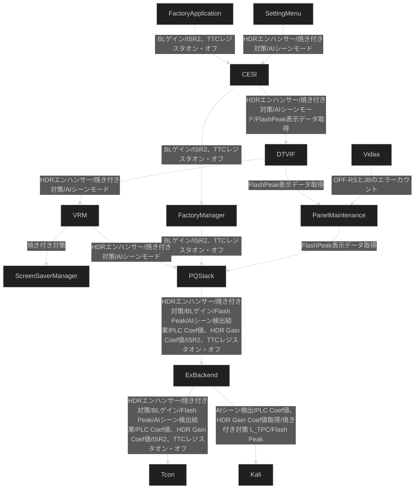

# SUM

## Terms

|Term | Definition | Note |
|-----|------------|------|


## Overview

```plantuml
[SettingMenu] as menu
[FactoryApplication] as fa
[Vidaa] as vidaa
[CESI] as cesi
[DTVIF] as dtvif
[PanelMaintenance] as pmm
[FactoryManager] as fact
[ScreenSaverManager] as ssm
[VRM] as vrm
[PQStack] as pq
[ExBackend] as bep
[Kali] as kali
node Tcon as tcon
vidaa --up--> pmm : OFF-RSとJBのエラーカウント
menu --> cesi : HDRエンハンサー/焼き付き対策/AIシーンモード
fa --> cesi : BLゲイン/ISR2、TTCレジスタオン・オフ
cesi --> dtvif : HDRエンハンサー/焼き付き対策/AIシーンモード/FlashPeak表示データ取得
cesi --> fact : BLゲイン/ISR2、TTCレジスタオン・オフ
dtvif --> vrm : HDRエンハンサー/焼き付き対策/AIシーンモード
dtvif --> pmm : FlashPeak表示データ取得
pmm --> pq : FlashPeak表示データ取得
fact --> pq : BLゲイン/ISR2、TTCレジスタオン・オフ
vrm --> pq : HDRエンハンサー/焼き付き対策/AIシーンモード
vrm -up-> ssm : 焼き付き対策
pq --> bep : HDRエンハンサー/焼き付き対策/BLゲイン/Flash Peak/AIシーン検出結果/PLC Coef値、HDR Gain Coef値/ISR2、TTCレジスタオン・オフ
bep --> tcon : HDRエンハンサー/焼き付き対策/BLゲイン/Flash Peak/AIシーン検出結果/PLC Coef値、HDR Gain Coef値/ISR2、TTCレジスタオン・オフ
bep --> kali : AIシーン検出/PLC Coef値、HDR Gain Coef値取得/焼き付き対策(L-TPC)/Flash Peak
```


